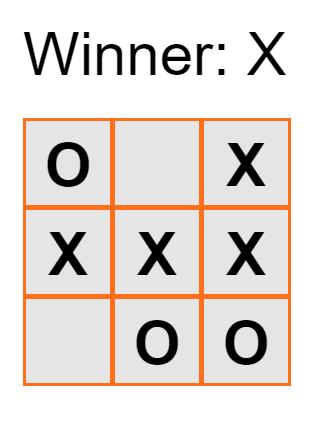

# Dio-Tic-Tac-Toe

This i a tic-tac-toe game built in React. Here we can practice and larn all the essencial concepts of this library.

The project's tutorial is in the oficial React documentation¹ and a 
JavaScript course by Digital Innovation One². Have fun! =D

1 - https://reactjs.org/tutorial/tutorial.html
2 - https://web.digitalinnovation.one/